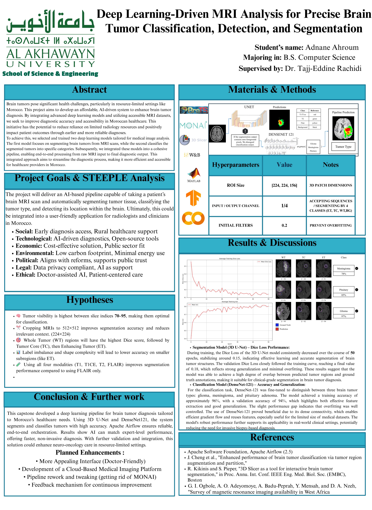
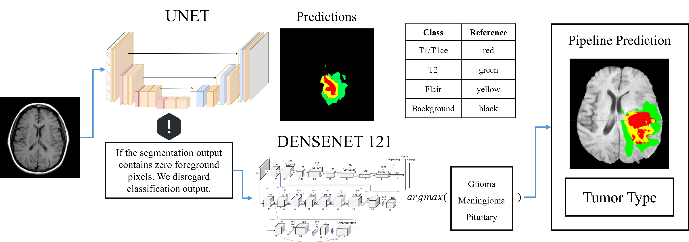
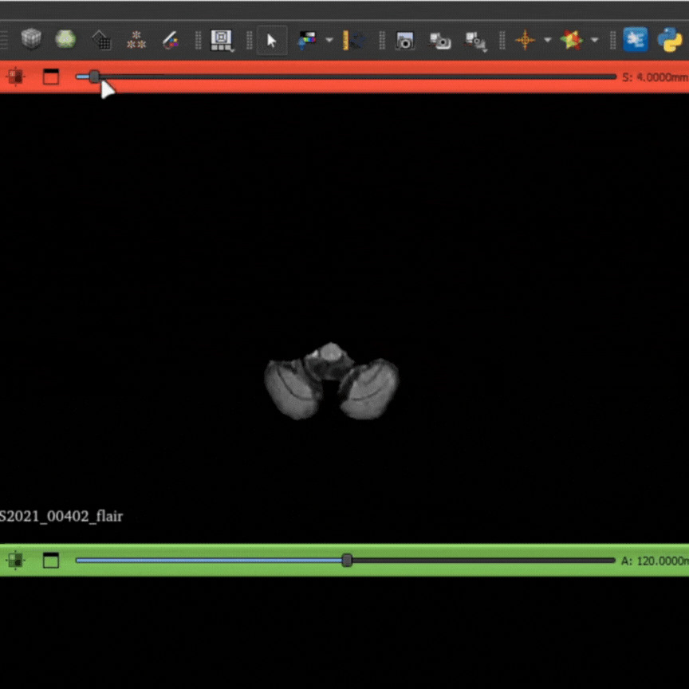
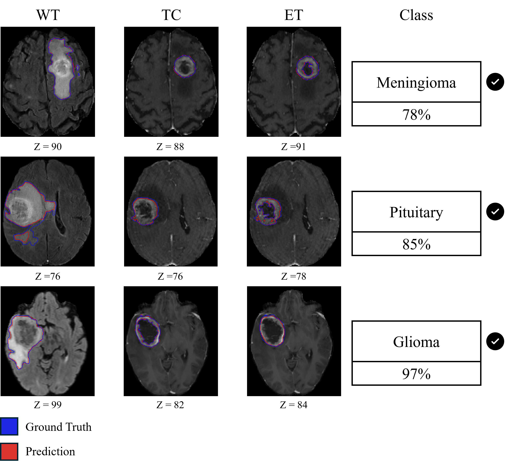

# Brain Tumor Segmentation and Classification Pipeline

## Overview
This repository contains a comprehensive pipeline for automatic brain tumor segmentation and classification using deep learning approaches. The pipeline utilizes the BraTS (Brain Tumor Segmentation) dataset from the University of Pennsylvania, which is widely used for developing and benchmarking brain tumor segmentation algorithms.

The project combines segmentation and classification in a two-stage pipeline that:
1. Identifies and segments tumor regions in MRI scans
2. Classifies the tumor type (Glioma, Meningioma, or Pituitary)

---

## Capstone Poster

---


## Pipeline Architecture


The pipeline consists of two main deep learning models:

### 1. Segmentation (U-Net)
The first stage uses a U-Net architecture to segment the brain MRI scans into different tissue types:
- T1/T1ce (shown in red)
- T2 (shown in green)
- FLAIR (shown in yellow)
- Background (black)

The segmentation model identifies potential tumor regions and creates a mask that highlights abnormal tissue.

### 2. Classification (DenseNet-121)
The second stage employs a DenseNet-121 architecture to classify the tumor type based on the segmented regions. The model determines the probability of the tumor being one of three types:
- Glioma
- Meningioma
- Pituitary

A conditional check is implemented to ensure robust predictions:
> If the segmentation output contains zero foreground pixels, the classification output is disregarded.

## Dataset
The pipeline uses the BraTS (Brain Tumor Segmentation) dataset from the University of Pennsylvania, which includes:
- Multi-modal MRI scans (T1, T1ce, T2, FLAIR)
- Expert-annotated segmentation masks
- Various types of brain tumors

Sample MRI data from the dataset:


## Results
The pipeline achieves excellent results in tumor type classification, as shown below:



### Classification Accuracy
- **Glioma**: 97% accuracy
- **Meningioma**: 78% accuracy
- **Pituitary**: 85% accuracy

The results demonstrate the effectiveness of the pipeline in both segmenting brain tumors and accurately classifying their types. The visualization shows:
- WT (Whole Tumor)
- TC (Tumor Core)
- ET (Enhancing Tumor)
- Ground Truth (blue outline)
- Prediction (red outline)

## Implementation
This project is implemented primarily using:
- Jupyter Notebooks (99.9%)
- MATLAB scripts (0.1%)

## Setup and Usage
1. Clone this repository
```bash
git clone https://github.com/Adnane-Ahroum/BrainTumorPipeline.git
cd BrainTumorPipeline
```

2. Install the required dependencies
```bash
pip install -r requirements.txt
```

3. Run the Jupyter notebooks to:
   - Process the BraTS dataset
   - Train the segmentation model
   - Train the classification model
   - Evaluate the full pipeline

## Future Work
- Enhance the model architecture for improved accuracy
- Implement additional tumor subtypes classification
- Develop a user-friendly interface for clinical use

## References
- BraTS Dataset: https://www.med.upenn.edu/cbica/brats2020/data.html
- U-Net Architecture: "U-Net: Convolutional Networks for Biomedical Image Segmentation"
- DenseNet: "Densely Connected Convolutional Networks"
